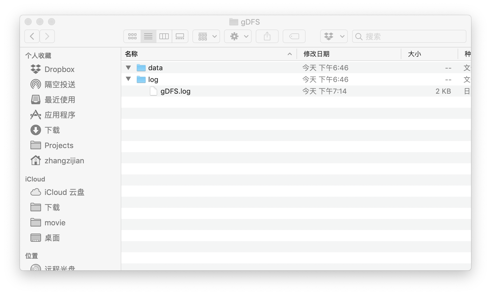

# gDFS

## 项目结构

gDFS 下有三个子模块，分别是

- proto
- nameNode
- dataNode

proto 模块中定义了 gRPC 的协议，在 Compile 之后会得到必要的类。因此，nameNode 以及 dataNode 都依赖 proto 模块。
Package 步骤会把依赖全部打包，所以速度较慢。
## 迭代目标

### 第一轮

1. 单层目录
2. 上传下载
3. 普遍的文件
4. 无 Client
5. master 节点直接挨个写

### 第二轮

1. 修改（可能只有 **append** ）删除
2. master 节点只需要等待第一个 slave 返回，而 slave 节点内部负责进行相应的备份
3. 模拟 TCP（这点严重存疑）

### 第三轮 

1. 心跳
2. 异常处理

### 第四轮

1. 待定


## Protocol Buffer

### master

在第一轮迭代，master 作为 client，调用 slave 的服务。master 要负责对用户给出的文件进行边读边分片，然后调用 slave 的函数来存储。当 slave 返回成功之后，master 应当保存相应的逻辑文件分块到物理文件块到映射表。在处理读请求时，master 查看映射关系，到相应的 slave 那里去读相应的块。master 在第一轮应该有以下两个重要的方法（不是真正定义，只表示概念方法）：

```java
class example{
void write(String nameInGDFS, URL fileLocation);
void read(String nameInGDFS, URL targetLocation);
}
```

### slave

在第一轮迭代，slave 作为 server，接受 master 的调用。初步确定有以下三个方法，具体实现参看 proto 模块 

```protobuf
service Slave{
    rpc addNewDataNode (PeerInfo) returns (DataNodeReply) {}

    rpc writeToBlock (WriteRequest) returns (WriteReply) {}
    rpc readBlockByID (ReadBlockRequest) returns (ReadBlockReply) {}
    rpc deleteBlockByID (DeleteBlockRequest) returns (DeleteBlockReply) {}

}
service Master{
    rpc register(RegisterRequest) returns (RegisterResponse) {}

    // data node 之间互相写 写好了会告诉你{我是谁，我写了什么文件，写的逻辑块号码，写的物理块号码} 以便你了解哪里有什么
    rpc reportDataWriteStatus(WriteReportRequest) returns (WriteReportReply) {}
    rpc reportDataDeleteStatus(DeleteReportRequest) returns (DeleteReportReply) {}
}
```


## DataNode 配置

Data node 的配置文件处在 resources 文件夹下，有以下的两个配置文件：

我的文件安排结构是

这个文件夹的地址在下列两个文件中都有体现

### dataNodeConfig.properties

```properties
nameNode.ip=localhost
nameNode.port=

dataNode.port=8988
# 上面的 data 文件夹的目录
dataNode.dataDir=/Users/zhangzijian/Downloads/gDFS/data 
```

### log4j2.xml

注意  `RollingFile` 那里的属性，虽然第二个不大知道有什么用。

```xml
<?xml version="1.0" encoding="UTF-8"?>
<Configuration status="WARN">
    <Appenders>
        <Console name="Console" target="SYSTEM_OUT">
            <PatternLayout pattern="%d{YYYY-MM-dd HH:mm:ss} [%t] %-5p %c{1}:%L - %msg%n" />
        </Console>
		<!--下面开始指定 log 文件地址-->
        <RollingFile name="RollingFile" filename="/Users/zhangzijian/Downloads/gDFS/log/gDFS.log" filepattern="${logPath}/%d{YYYYMMddHHmmss}-fargo.log">
        <!--上面指定了 log 文件地址-->
            <PatternLayout pattern="%d{YYYY-MM-dd HH:mm:ss} [%t] %-5p %c{1}:%L - %msg%n" />
            <Policies>
                <SizeBasedTriggeringPolicy size="10 MB" />
            </Policies>
            <DefaultRolloverStrategy max="20" />
        </RollingFile>
    </Appenders>

    <Loggers>
        <Root level="info">
            <AppenderRef ref="Console" />
            <AppenderRef ref="RollingFile" />
        </Root>
    </Loggers>
</Configuration>
```

